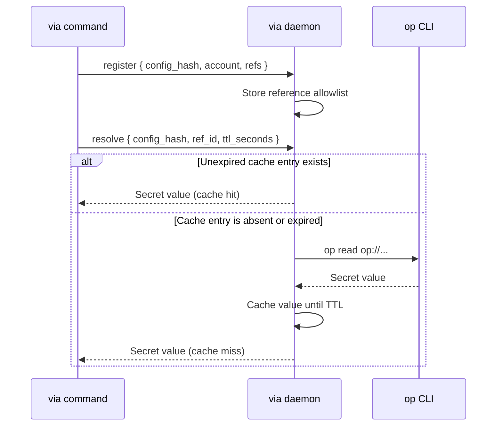

# Daemon Architecture

The `via` daemon reduces repeated 1Password reads. It stores resolved values
and OAuth token state in per-user memory.

The daemon is part of the CLI. Users do not install a separate service.

On macOS and Linux, `cache = "daemon"` is the default for 1Password. On
Windows, the default is `cache = "off"` until `via` has a named-pipe backend.

```toml
[providers.onepassword]
type = "1password"
cache = "daemon"
cache_ttl_seconds = 300
```

Set `cache = "off"` to make each 1Password secret read call `op read`
directly.

## Request Flow

Before a daemon-backed resolution, the client registers the references allowed
by its configuration.



The normal resolve request contains only `config_hash`, `ref_id`, and the
configured time to live (TTL). The response contains the value that `via`
needs.

Registration sends raw `op://` references. The daemon uses them to enforce the
configuration allowlist and to run `op read` after a cache miss.

The daemon keeps these data structures in memory:

| State | Key | Value | Removal condition |
| --- | --- | --- | --- |
| Reference allowlist | `config_hash` and `ref_id` | Configured `op://` reference | Clear, stop, idle exit, or restart |
| Secret cache | `config_hash` and `ref_id` | Resolved value and expiry | TTL expiry, clear, stop, idle exit, or restart |
| OAuth state | Credential-derived cache key | Access token and optional refresh state | Token expiry rules, clear, stop, idle exit, or restart |

The default secret TTL is 300 seconds. The daemon removes expired entries
before it handles each request.

## Auto-Start And Lifetime

A command that needs daemon-backed state starts the daemon when its socket is
unavailable.

On Linux, `via` first calls `systemd-run --user`. On macOS, `via` first creates
and starts a per-user LaunchAgent through `launchctl`.

These managed processes can survive the shell, editor task, or agent process
that started them.

If the user service manager is unavailable, `via` starts a detached daemon
process. This fallback supports minimal shells, containers, and SSH sessions.

The daemon exits after 15 minutes without a connection. A later command starts
a new daemon at the same socket path.

## Socket Location And Permissions

The daemon listens on a Unix domain socket. `via` selects the first available
location:

1. `VIA_DAEMON_SOCKET`
2. `$XDG_RUNTIME_DIR/via/daemon.sock`
3. `<system temporary directory>/via-<user-id>/daemon.sock`

The fallback user ID is the nonempty `UID` value. If `UID` is unavailable,
via uses the alphanumeric and underscore characters from `USER`. It uses
`unknown` when neither value identifies the user.

`via` creates the socket directory with mode `0700`. It sets the socket file to
mode `0600`.

The daemon is unsupported on Windows. Windows daemon control commands report
`via daemon: unsupported`.

## Manage The Daemon

Check its state:

```sh
via daemon status
```

A running daemon reports `via daemon: running` and its cached entry count. An
unavailable daemon reports `via daemon: stopped`.

Clear all memory-held state:

```sh
via daemon clear
```

This command removes secret values, OAuth state, and registered allowlists. It
keeps the daemon running.

Stop the daemon:

```sh
via daemon stop
```

The next command that needs daemon state starts it again.

`via daemon serve` is an internal auto-start command. Normal help output hides
it.

## Verify Cache Behavior

Run a configured command twice with timing enabled:

```sh
VIA_TIMING=1 via github api GET /repos/example-org/example-repo >/tmp/via.json
VIA_TIMING=1 via github api GET /repos/example-org/example-repo >/tmp/via.json
```

The second run should include this timing result:

```text
1password daemon resolve cache=hit
```

Clear the cache, then verify that the next request repopulates it:

```sh
via daemon clear
via daemon status
VIA_TIMING=1 via github api GET /repos/example-org/example-repo >/tmp/via.json
```

After `clear`, `status` should report zero cached entries. The next request
should report a cache miss for each required value.

Stop the daemon, then verify auto-start:

```sh
via daemon stop
via daemon status
VIA_TIMING=1 via github api GET /repos/example-org/example-repo >/tmp/via.json
via daemon status
```

The first status should report `stopped`. The final status should report
`running`.

## Verify The Socket Guard

Run this executable-identity guard test only on Linux or macOS. Other Unix
targets enforce socket permissions and reference registration without this
peer-executable check.

Choose a dedicated socket and start the daemon through a configured command.
Keep the same variable set for the guard script:

```sh
guard_dir="$(mktemp -d)"
guard_via="$(command -v via)"
export VIA_DAEMON_SOCKET="$guard_dir/daemon.sock"
VIA_TIMING=1 "$guard_via" github api GET /repos/example-org/example-repo >/tmp/via.json
VIA_BIN="$guard_via" scripts/validate-daemon-socket-guard.sh
"$guard_via" daemon stop
rmdir "$guard_dir"
unset VIA_DAEMON_SOCKET
```

The script uses Python to connect as a raw, non-`via` socket client. It expects
the daemon to reject each request before protocol handling. It requires
`VIA_DAEMON_SOCKET` so the probe cannot derive a different platform default.

The `VIA_BIN` value must match the executable that started the daemon.

A healthy run ends with:

```text
PASS daemon still responds to via after raw-client probes
```

## Security Boundary

Plaintext values pass through the local socket because the requesting process
must build headers, generate tokens, or populate a delegated environment.

The daemon never writes cached values to disk. OAuth access tokens and refresh
state also remain in daemon memory.

Socket permissions restrict connections to the local user. On Linux and
macOS, the daemon also checks the peer process executable before reading its
request.

The daemon accepts a peer that matches its own `via` executable path or inode.
The registration allowlist then blocks unregistered references on the normal
resolve path.

WARNING: Do not use the daemon as a security boundary between same-user
processes. Use separate OS users, containers, or sandboxes for agents that must
not share secret access.

A same-user process can run `via`, read user-accessible files, or run `op read`
when the 1Password session allows it. The executable check only adds defense in
depth.

For less 1Password secret retention, set `cache = "off"`. You can also run
`via daemon stop` before handing execution to another process.

These actions do not isolate a same-user process. That process can start the
daemon again or use `op` directly.

Rotating OAuth refresh tokens need additional care. A clear, stop, idle exit,
restart, or reboot removes the newest in-memory refresh state.

If that state disappears after rotation, complete OAuth setup again. Then
update the configured 1Password credential bundle.

## Troubleshoot From Observable Results

| Result | Cause to check | Corrective action |
| --- | --- | --- |
| `via daemon status` reports `stopped` | No daemon-backed command has started the daemon. | Run a configured command that uses daemon state. |
| Auto-start times out | The service manager and detached spawn both failed, or the socket never became ready. | Read the reported start attempts and fix the named executable or environment. |
| Every timed request reports `cache=miss` | Entries expire, the daemon restarts, or the configuration hash changes. | Check `via daemon status`, the TTL, and recent config changes. |
| `op read` fails after a cache miss | The daemon cannot find `op`, or 1Password authentication is unavailable. | Fix the daemon `PATH`, unlock 1Password, and run `op whoami`. |
| A raw socket probe reaches the protocol on Linux or macOS | The executable guard did not reject the client. | Stop using the daemon and investigate the platform guard before continuing. |
| OAuth stops after a daemon restart | A rotating refresh token existed only in daemon memory. | Repeat OAuth setup and update the 1Password credential bundle. |
