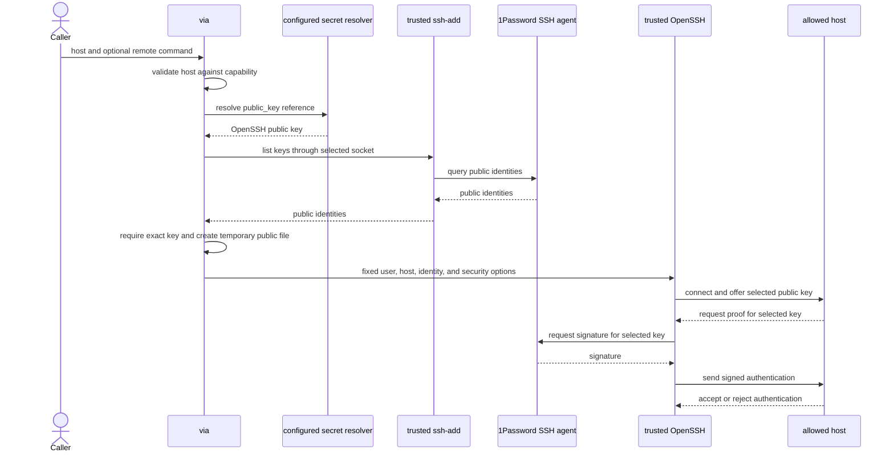

# 1Password SSH Agent Setup

This guide configures a via SSH capability that can use one agent-backed key
with a limited set of hosts. The private key remains in 1Password.

via does not increase the server's `MaxAuthTries` value. It clears default
identities, supplies one public key, and enables `IdentitiesOnly`.

## How The Connection Works

via completes identity and policy checks before OpenSSH contacts the host.



The network connection starts only after the exact-key preflight succeeds.
The resolver can call 1Password directly or use the configured daemon cache.

## 1. Prepare 1Password And The Server

Install the 1Password desktop app and CLI. Enable both integrations in the
desktop app:

- Integrate with 1Password CLI.
- Use the SSH agent.

Create or import an SSH Key item in 1Password. Make the key available to the
1Password SSH agent, then install its public key for the intended server user.
For example, install the key in the `authorized_keys` file for `deploy`.

Keep the private key in 1Password. The via profile references the SSH Key
item's `public key` field:

```text
op://Private/Example SSH Key/public key
```

via resolves one OpenSSH public-key line from that reference. It validates the
key type and key data before starting OpenSSH. It does not resolve or write the
private key.

Put this direct reference in `ssh_profiles`. Do not add the private key to the
via config or to a service's `secrets` table.

The public key is not confidential, but the direct reference avoids a separate
persistent key file. via creates the required public-key file only for the SSH
process and removes it afterward.

Install the OpenSSH client. The installation must provide both `ssh` and
`ssh-add`. Verify the primary tools:

```sh
via --version
op --version
ssh -V
```

The doctor later checks the pinned OpenSSH paths. It uses `ssh-add` for an
offline identity preflight.

## 2. Configure The SSH Profile

Add a top-level SSH profile and reference it from an SSH capability:

```toml
version = 1

[providers.onepassword]
type = "1password"

[ssh_profiles.example]
provider = "onepassword"
public_key = "op://Private/Example SSH Key/public key"

[services.example]
description = "SSH access to example servers"
hint = "via example shell server-01.example.com"
provider = "onepassword"

[services.example.commands.shell]
description = "Open a public-key-only SSH session as deploy."
mode = "ssh"
profile = "example"
user = "deploy"
hosts = ["server-*.example.com", "192.0.2.10"]
port = 22
```

Omitting `cache` uses the platform default. Unix-like systems use the daemon,
while Windows resolves the public-key reference directly.

The service-level `provider` remains required for every service. The SSH
profile's `provider` resolves the `public_key` reference.

The profile fields have these meanings:

| Field | Requirement | Meaning |
| --- | --- | --- |
| `provider` | Required | Provider used to resolve the public-key reference. It must name a configured provider. |
| `public_key` | Required | Direct `op://` reference to one OpenSSH public key. |
| `agent_socket` | Optional | Absolute alternate agent endpoint on Unix. Omit it for the 1Password default. Windows always uses the fixed OpenSSH agent pipe. |
| `ssh_program` | Optional pair | Absolute path to a trusted OpenSSH client. Omit both program fields for the platform default. |
| `ssh_add_program` | Optional pair | Absolute path to matching trusted `ssh-add` in the same directory. |

The SSH command fields have these meanings:

| Field | Requirement | Meaning |
| --- | --- | --- |
| `profile` | Required | Name of a configured top-level SSH profile. |
| `user` | Required | Fixed remote user for this capability. |
| `hosts` | Required | Nonempty list of allowed host patterns. |
| `port` | Optional | Fixed TCP port from 1 through 65535. The default is 22. |

Use separate capabilities when users, ports, keys, or host groups have
different trust boundaries.

## 3. Limit The Hosts

Each `hosts` entry matches the complete host argument without regard to case.
The `*` wildcard matches zero or more characters. The `?` wildcard matches one
character. Host values use ASCII letters, digits, `.`, `-`, `_`, `:`, and `%`;
patterns may additionally use `*` and `?`. Use an ASCII-compatible (punycode)
name for an internationalized DNS name. Negation and character classes are not
supported.

Examples:

```toml
hosts = [
  "server-01.example.com", # Exact DNS name
  "server-*.example.com",  # Restricted wildcard
  "192.0.2.10",            # Exact IPv4 address
  "2001:db8::10",          # Exact IPv6 address
]
```

The matcher checks the host text supplied to via. It does not match a resolved
address or canonical name. The runtime host cannot contain a user, port, path,
whitespace, or wildcard. It also cannot start with `-`.

This allowlist limits the destination argument. It does not pin a resolved IP
address or replace OpenSSH host-key verification.

Do not use `hosts = ["*"]` unless the capability is intentionally allowed to
connect anywhere. Prefer exact hosts or the narrowest stable wildcard.

## 4. Select The Agent Socket

If `agent_socket` is absent, via uses the platform's standard 1Password SSH
agent endpoint:

| Platform | Default endpoint |
| --- | --- |
| macOS | `$HOME/Library/Group Containers/2BUA8C4S2C.com.1password/t/agent.sock` |
| Linux and other Unix systems | `$HOME/.1password/agent.sock` |
| Windows | `\\.\pipe\openssh-ssh-agent` |

On Unix, set `agent_socket` only when the agent uses another endpoint. Explicit
socket paths must be absolute. Do not use `~` or `$HOME`; via does not apply
shell expansion to configured paths.

```toml
[ssh_profiles.example]
provider = "onepassword"
public_key = "op://Private/Example SSH Key/public key"
agent_socket = "/absolute/path/to/agent.sock"
```

Windows uses the fixed `\\.\pipe\openssh-ssh-agent` endpoint and rejects a
different configured endpoint. On Unix, via also verifies that the selected
path is a Unix socket. On every platform, via asks `ssh-add` to list identities
through the selected endpoint. The command fails before a network connection
if the endpoint is unavailable.

via never selects `ssh` or `ssh-add` from the caller's `PATH`. This prevents a
shadow executable from receiving the selected agent endpoint or bypassing the
capability policy. The trusted defaults are:

| Platform | `ssh` | `ssh-add` |
| --- | --- | --- |
| macOS, Linux, and other Unix systems | `/usr/bin/ssh`, then system NixOS or `/bin` fallback | Matching `ssh-add` from the same directory |
| Windows | `<Windows system directory>\OpenSSH\ssh.exe` | Matching `ssh-add.exe` from that directory |

On Windows, via obtains the system directory from the operating system. It
does not trust `SystemRoot` or `WINDIR` to locate OpenSSH.

The NixOS fallback is `/run/current-system/sw/bin`; via only selects a default
directory when both tools exist there. If OpenSSH is installed elsewhere, set
both paths explicitly using absolute paths to binaries you trust. The two
fields must be configured together and must use the same directory:

```toml
[ssh_profiles.example]
provider = "onepassword"
public_key = "op://Private/Example SSH Key/public key"
ssh_program = "/run/current-system/sw/bin/ssh"
ssh_add_program = "/run/current-system/sw/bin/ssh-add"
```

## 5. Understand The Enforced SSH Policy

For each connection, via:

- Clears the child environment and restores a small process-environment
  allowlist plus the selected agent endpoint.
- Resolves and validates one public key.
- Queries the selected agent with `ssh-add -L` and requires that exact key.
- Writes that public key inside a private temporary directory.
- Clears OpenSSH's default identity-file list.
- Starts OpenSSH with `IdentitiesOnly=yes` and only the temporary public-key file.
- Disables automatic SSH certificate discovery for that identity.
- Allows only public-key authentication.
- Disables password, keyboard-interactive, and host-based authentication.
- Disables SSH agent forwarding.
- Disables forwarding, X11, local commands, and SSH escape commands.
- Prevents OpenSSH from adding identities to the agent.
- Fixes the remote user and optional port from the capability.
- Rejects hosts outside the capability's `hosts` list.
- Removes the temporary public-key file and directory after OpenSSH exits.

The child does not receive `PATH`. It can receive `HOME`, `USER`, `LOGNAME`,
`SHELL`, `TERM`, `LANG`, `LC_ALL`, Windows profile/system/temp variables, and
the selected `SSH_AUTH_SOCK`. Other inherited variables are removed.

On Unix, the temporary directory has mode `0700` and its public-key file has
mode `0600`. On Windows, they inherit the access control list of the user's
temporary directory. The file never contains private key material.

via starts OpenSSH with `-F none`. OpenSSH does not read user or system
`ssh_config` files. Host aliases, `ProxyJump`, `IdentityFile`, forwarding, and
other local configuration do not affect the capability.

Normal OpenSSH host-key verification remains enabled. OpenSSH still uses its
built-in default `known_hosts` locations. via does not set
`StrictHostKeyChecking=no` or accept changed host keys.

The SSH agent can still contain many keys. `IdentitiesOnly=yes` makes OpenSSH
offer only the private identity that matches the configured public key.

## 6. Connect Or Run A Remote Command

Open an interactive remote shell:

```sh
via example shell server-01.example.com
```

via inherits terminal input, output, and error streams for the SSH process.
The 1Password app can request approval for the matching key. Exit the remote
shell in the usual way.

SSH output is interactive and is not buffered for secret redaction. Do not run
remote commands that print credentials or other sensitive values.

Run one remote command by adding its arguments after the host:

```sh
via example shell server-01.example.com uname -a
via example shell server-01.example.com uptime
```

OpenSSH combines the remaining arguments using its normal remote-command
semantics. The SSH server can pass that command to the remote user's shell.
Quote shell syntax for that remote shell carefully.

via preserves OpenSSH exit values from 1 through 255. A terminated process
without an exit value returns 1.

Caller-supplied local OpenSSH options are not supported. For example, `-v`
after the host is remote command text, not a local verbosity option. Configure
the user, port, hosts, and identity in via instead.

## 7. Verify The Capability

Check provider access, the public-key reference, the selected agent identity,
and the OpenSSH tools:

```sh
via login
via config doctor example
via capabilities
```

The doctor resolves the public-key reference and runs `ssh-add -L` against the
selected endpoint. It requires the exact key type and key data. This preflight
does not open an SSH network connection or print the agent's key list.

Then run a small remote command against one allowed host:

```sh
via example shell server-01.example.com true
```

If the host is new, OpenSSH can ask for host-key confirmation. Compare the
displayed fingerprint with one obtained through a trusted administrative
channel before accepting it. Prepare `known_hosts` first for unattended use.
Do not disable host-key checking.

## 8. Troubleshoot

### Agent Socket Is Unavailable

Open and unlock 1Password. Enable its SSH agent, then confirm the default
endpoint exists. Install `ssh-add` with the OpenSSH client. On Unix, set an
absolute `agent_socket` only if the endpoint is custom.

### The OpenSSH Program Is Unavailable

Install both OpenSSH tools in a recognized system directory. For another
location, configure both absolute program paths from the same directory.

### The Public Key Is Not Available From The Agent

Confirm that `public_key` references the same SSH Key item that the agent can
use. Check the item's SSH-agent access rules in 1Password. via compares the
configured key type and key data with `ssh-add -L` before connecting.

### `Permission denied (publickey)`

Confirm that the matching public key is authorized for the configured `user`.
Also confirm the host and configured port are correct. Password and
keyboard-interactive fallbacks are intentionally disabled.

### `Host key verification failed`

For a new server, add its verified host key to `known_hosts`. For a changed
server key, stop and verify the change through a trusted channel before
updating `known_hosts`.

### The Host Is Not Allowed

Pass a host that matches the configured list, or add the narrowest appropriate
pattern. Do not include `user@`, a port, or an SSH option in the host argument.

### `Too many authentication failures`

Confirm that the command uses `mode = "ssh"` and the intended profile. The SSH
mode selects one identity, so increasing the server's `MaxAuthTries` value is
not the recommended fix.

## Current Limitations

The first SSH mode supports direct connections only. Configure it by editing
TOML. The interactive `via config` wizard does not create SSH profiles yet.

SSH mode does not support `ProxyJump`, `ProxyCommand`, tunnels, port
forwarding, or caller-supplied local OpenSSH options.

The SSH profile also does not apply inside another delegated program. A
delegated `git`, `rsync`, or similar command does not receive a nested SSH
adapter or inherit this profile's selected agent identity. Use the SSH
capability for direct sessions and remote commands until a dedicated nested
transport adapter is available.

## References

- [1Password SSH agent](https://www.1password.dev/ssh/agent/)
- [1Password SSH agent advanced configuration](https://www.1password.dev/ssh/agent/advanced)
- [OpenSSH client manual](https://man.openbsd.org/ssh)
- [OpenSSH client configuration manual](https://man.openbsd.org/ssh_config)
